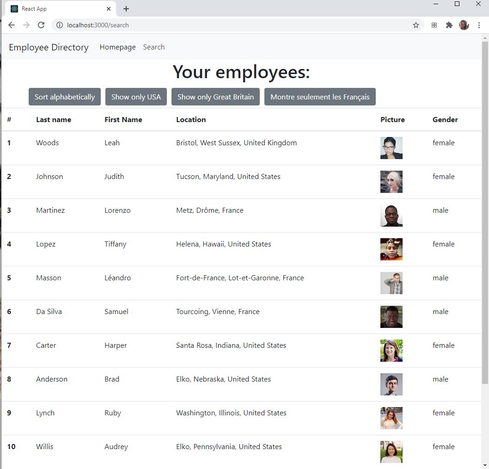

# lannuaire 

# Table of contents
1. [Description](#Description)
2. [Installation instructions](#Installation-instructions)
3. [Usage](#usage)
4. [Contributions](#Contributions)
5. [Testing instructions](#Testing-instructions)
6. [License](#License)
7. [Questions](#Questions)

## Description: 
This is a website for viewing non-sensitive information about employees and coworkers. The user can alphebetize their list and/or filter by country.

This application is deployed  <a href='https://skolnikskolnik.github.io/lannuaire'>here.</a> 

The user is greeted with the following screen:

The user can alphebatize and/or filter by country:
The user is greeted with the following screen:

## Installation instructions: 
Users should run npm install to install the dependencies before running locally.

## Usage: 
This is catered towards managers of international companies.

## Contributions: 
This is currently a solo project of skolnikskolnik.

## Testing instructions: 
Try alphebetizing your lists to verify the functionality works.

## License:  
This project is covered under the MIT License license.

## Questions
Visit my <a href='https://www.github.com/skolnikskolnik'>github page.</a> 

Email me at jtskolnik@gmail.com with any additional questions you may have. I am always happy to talk to users of my product!
    